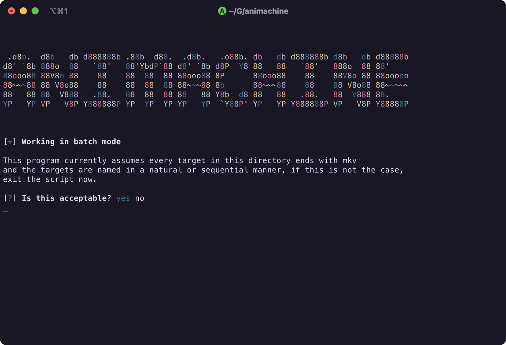

# anat0m1a's animachine 

This is just a silly redo of my [old](https://github.com/anat0m1a/animachine) attempt at the idea.

There are two reasons I created this

1. I wanted an excuse to write C/C++
2. I wanted something which attempts to deal with batch processing TV shows in the way that I want, grabbing information directly from mediainfo

This is highly individualised to my use case and won't work for everyone. It's main concern is taking a source medium which is most likely a blu-ray rip, and transcoding that into HEVC and potentially burning in some subs.

If this sounds useful to you, give it a go, or be my guest to fork it and make it your own.

## Preview

## Build Requirements

for build deps:
- libmediainfo
- pkgconf

to actually build:
- cmake 
- a build system, ninja works fine
- a compiler etc. :)

cmake -S . -B build -G Ninja -DCMAKE_BUILD_TYPE=Release
ninja -C build

src/build/animachine ... tada

## Usage

animachine always expects two positional arguments. That is:

1. `<source file>` `<dest file>`
2. `<source folder>` `<dest folder>`

All other options are handled by cpp-inquirer. Some will hate this, but I wanted something interactive that shows me the available options and guides me through.  At the end of the day, the first encode probably won't be perfect anyway, so it's naturally an involved process.

The program will guide you through selecting your options, and then, if you're doing a batch run, transcode everything from `<source dir>` into `<dest dir>` with your selected options.

I may make some updates here and there genericing this a bit and decoupling it from anime, but as its my main use case at the moment, this is what was created.
